# Sentri (Sentinal + Triage)

**System:** AI-Powered Log Triage & Root Cause Analysis Platform

---

## 1. System Overview

Sentri is a self-hosted, event-driven triage layer that consumes real-time log events from a running application via Kafka, detects severity-worthy incidents, notifies the responsible owner with a single-use link, and generates AI-assisted root cause analysis by retrieving relevant context from existing log history (OpenSearch) and the application's codebase (GitHub).

Sentri does not host log storage, message brokering, or LLM inference — it connects to infrastructure the adopter already runs (BYO Kafka, BYO OpenSearch, BYOK LLM), and ships only its own processing, reasoning, and UI components.

---

## 2. Functional Requirements (FR)

| ID | Requirement |
|---|---|
| FR-1 | The system shall consume structured JSON log events in real time from a Kafka topic. |
| FR-2 | The system shall classify each log event by severity (ERROR, WARN, INFO, DEBUG) and act only on ERROR/WARN. |
| FR-3 | The system shall deduplicate repeated identical errors within a configurable time window, sending a single alert instead of one per occurrence. |
| FR-4 | The system shall route each triggered incident to the correct owner/team based on a `service_name` → owner mapping. |
| FR-5 | The system shall generate a signed, single-use, time-bound magic link for each triggered incident. |
| FR-6 | The system shall notify the responsible owner via Slack webhook (primary) or email (fallback) with the magic link. |
| FR-7 | On clicking the magic link, the system shall render a chat interface scoped to that specific incident. |
| FR-8 | The system shall retrieve related historical log context from OpenSearch, scoped by `service_name` and `trace_id`, and time window. |
| FR-9 | The system shall retrieve related code context from a vector store, scoped by service, using semantic similarity search. |
| FR-10 | The system shall re-embed the connected codebase automatically when new commits are pushed to the configured GitHub repository. |
| FR-11 | The system shall generate a structured root cause analysis: hypothesis, confidence score, and suggested fix, grounded in retrieved log and code context. |
| FR-12 | The system shall support follow-up questions in the chat interface, using the same retrieval-augmented pipeline. |
| FR-13 | The system shall self-correct retrieval — if retrieved context is graded insufficient, it shall rewrite the query and retry before generating a final answer. |
| FR-14 | The system shall allow the LLM provider (Gemini/OpenAI/Anthropic) and API key to be configured per deployment (BYOK). |
| FR-15 | The system shall allow adopters to connect their own Kafka cluster, OpenSearch cluster, and GitHub repository via environment variables, without code changes. |
| FR-16 | The system shall provide a lightweight producer SDK so adopters can integrate log shipping with minimal code changes to their existing application. |

---

## 3. Non-Functional Requirements (NFR)

| ID | Category | Requirement |
|---|---|---|
| NFR-1 | Performance | The system shall process and classify an incoming log event within 2 seconds of it being written to Kafka, under normal load. |
| NFR-2 | Scalability | The Triage Engine shall run as a Kafka consumer group, allowing horizontal scaling by adding consumer instances without code changes. |
| NFR-3 | Availability | The system shall not lose log events on restart — Kafka consumer offsets shall be committed only after successful processing (at-least-once delivery). |
| NFR-4 | Security | Magic links shall be single-use, JWT-signed, and expire within a configurable window (default 1 hour). |
| NFR-5 | Security | GitHub access shall use fine-grained, read-only, repo-scoped tokens — never full-account access. |
| NFR-6 | Security | Secrets (API keys, credentials) shall be injected only as runtime environment variables, never as Docker build arguments or committed files. |
| NFR-7 | Portability | The owned components shall run identically via Docker Compose on local machines, Railway, Render, or a bare VM — no platform-specific code. |
| NFR-8 | Cost | The reference deployment shall operate within free-tier limits for Kafka, OpenSearch, LLM API, and vector store for low-traffic workloads. |
| NFR-9 | Extensibility | Adding a new log severity rule or notification channel shall not require changes to the Kafka ingestion or OpenSearch storage layer. |
| NFR-10 | Isolation | In multi-service deployments, log and code retrieval shall be strictly scoped by `service_name`, preventing cross-service context leakage in RCA output. |
| NFR-11 | Usability | A new adopter shall be able to complete setup (env vars + `docker compose up`) and receive their first test alert within 30 minutes, per documented `SETUP.md`. |
| NFR-12 | Maintainability | Core business logic (severity filter, dedup, routing) shall be decoupled from storage/ingestion, allowing OpenSearch or Kafka to be swapped without rewriting the Triage Engine. |
| NFR-13 | Reliability | Duplicate alert suppression (FR-3) shall have a false-negative rate low enough that no more than one alert is sent per genuinely distinct incident, under normal conditions. |

---

## 4. System Architecture

```mermaid
flowchart TB
    subgraph USERINFRA["User-Owned Infrastructure (BYO)"]
        direction TB
        APP["User's App<br/>emits structured JSON logs"]
        SDK["triage-logger SDK<br/>3-line integration"]
        K[("Kafka Topic<br/>BYO cluster")]
        OS[(OpenSearch Cluster<br/>BYO + ingestion-kafka plugin)]
        GH["GitHub Repo<br/>BYO PAT, read-only"]
    end

    subgraph OWNED["Sentri — Owned Components (Docker Compose)"]
        direction TB

        subgraph TRIAGE["Triage Service (modular monolith)"]
            direction TB
            TE["Triage Engine<br/>own Kafka consumer group"]
            SEV{"Severity ==<br/>ERROR/WARN?"}
            DEDUP{"Duplicate within<br/>dedup window?"}
            ROUTE["Owner Router<br/>service_name -> team mapping"]
            LINK["Signed JWT magic link<br/>single-use, expiry-bound"]
            NOTIFY["Notify Service<br/>Slack webhook / SMTP fallback"]
        end

        subgraph RAG["RAG Orchestrator (LangGraph)"]
            direction TB
            ORCH["Orchestrator"]
            RLOG["Retrieve logs<br/>OpenSearch, scoped by service_name + trace_id"]
            RCODE["Retrieve code<br/>vector similarity, scoped by service"]
            GRADE{"Context<br/>sufficient?"}
            LLM["LLM Reasoning<br/>BYOK: Gemini / OpenAI / Anthropic"]
            OUT["Structured RCA<br/>cause + confidence + fix + code link"]
        end

        VEC[(ChromaDB<br/>owned, ephemeral)]
        EMBED["Embedding Job<br/>triggered on GitHub push webhook"]
        CHAT["Chat UI - React<br/>RCA conversation + timeline"]
    end

    DEV["Dev / Service Owner"]

    APP --> SDK
    SDK -- "JSON logs" --> K
    K --> OS
    K -- "parallel consume" --> TE

    TE --> SEV
    SEV -- "no" --> DISCARD["Discard / index only"]
    SEV -- "yes" --> DEDUP
    DEDUP -- "suppress" --> DISCARD
    DEDUP -- "new incident" --> ROUTE
    ROUTE --> LINK
    LINK --> NOTIFY
    NOTIFY -- "alert + link" --> DEV
    DEV -- "clicks link" --> CHAT

    CHAT -- "question" --> ORCH
    ORCH --> RLOG
    ORCH --> RCODE
    RLOG --> OS
    RCODE --> VEC
    RLOG --> GRADE
    RCODE --> GRADE
    GRADE -- "insufficient, rewrite query" --> ORCH
    GRADE -- "sufficient" --> LLM
    LLM --> OUT
    OUT --> CHAT

    GH --> EMBED
    EMBED --> VEC

    classDef userinfra fill:#4a5568,color:#fff,stroke:#2d3748
    classDef service fill:#2f855a,color:#fff,stroke:#1c4532
    classDef ai fill:#805ad5,color:#fff,stroke:#553c9a
    classDef decision fill:#dd6b20,color:#fff,stroke:#9c4221
    classDef ui fill:#3182ce,color:#fff,stroke:#2c5282
    classDef store fill:#2b6cb0,color:#fff,stroke:#1a4971

    class APP,SDK,K,OS,GH userinfra
    class TE,ROUTE,LINK,NOTIFY,EMBED service
    class ORCH,RLOG,RCODE,LLM,OUT ai
    class SEV,DEDUP,GRADE decision
    class CHAT,DEV ui
    class VEC store
```

---

## 5. Component Responsibilities

| Component | Owns | Does Not Own |
|---|---|---|
| Kafka Topic | Log event transport | Not deployed by Sentri — BYO |
| OpenSearch | Log storage, historical query | Not deployed by Sentri — BYO |
| Triage Engine | Severity filter, dedup, owner routing, link generation | Storage, LLM reasoning |
| Notify Service | Alert delivery (Slack/email) | Incident detection logic |
| RAG Orchestrator | Retrieval coordination, self-correction loop | Raw storage of logs or code |
| ChromaDB | Code embedding cache | Long-term log storage |
| Chat UI | RCA conversation rendering | Retrieval or reasoning logic |
| LLM Provider | Reasoning over provided context | Data retrieval, credentials management |

---

## 6. Data Flow Summary

1. Application emits structured JSON log → Kafka topic (FR-1).
2. OpenSearch ingests directly via native Kafka plugin — no custom consumer for storage.
3. Triage Engine consumes the same topic in parallel, applies severity + dedup + routing logic (FR-2, FR-3, FR-4).
4. On a new incident, a signed magic link is generated and delivered via Notify Service (FR-5, FR-6).
5. Developer opens the link, landing on a scoped Chat UI (FR-7).
6. RAG Orchestrator retrieves relevant logs (OpenSearch) and code (ChromaDB), both scoped by `service_name` (FR-8, FR-9, NFR-10).
7. If context is weak, the orchestrator rewrites and retries retrieval before generating an answer (FR-13).
8. LLM produces a structured RCA response, rendered in the Chat UI (FR-11).
9. Developer can ask follow-up questions, re-triggering the same retrieval pipeline (FR-12).

---

## 7. Assumptions & Constraints

- Adopters already operate a Kafka cluster and an OpenSearch cluster (or are willing to provision the free-tier versions documented separately).
- Log volume for the reference deployment small scaled services is low enough to remain within free-tier quotas for Kafka, OpenSearch, and the LLM provider.
- Adopters are responsible for their own LLM provider account and API costs beyond free-tier limits.
- The system assumes at-least-once Kafka delivery semantics; exactly-once processing is not a current requirement.

---
